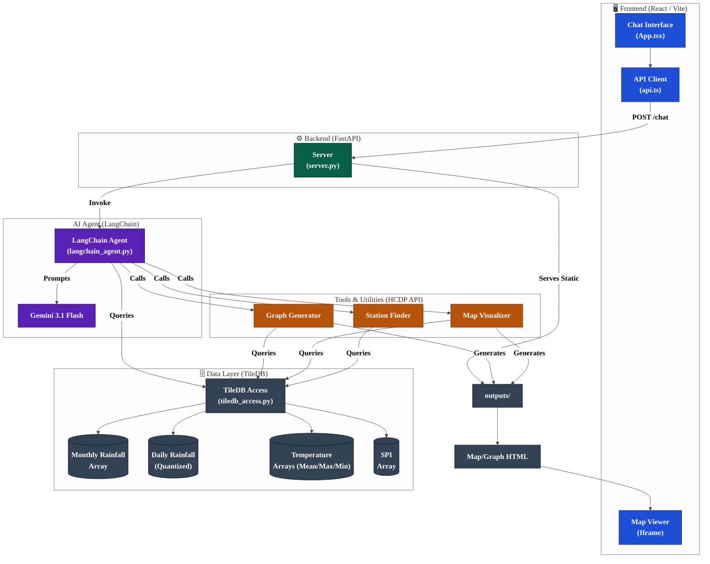

# System Architecture

The following diagram illustrates the interaction between the React frontend, FastAPI backend, LangChain AI agent, and the TileDB climate database.

## Component Breakdown

1.  **React Frontend**: Provides a premium chat interface where users can ask natural language questions. It displays the assistant's text responses and renders generated interactive maps in an iframe.
2.  **FastAPI Backend**: Acts as the bridge between the frontend and the AI. It manages conversation sessions, serves generated HTML from a dedicated `outputs/` directory, and orchestrates an automated **Cleanup Manager** to prune stale files.
3.  **LangChain Agent**: The "brain" of the application. It uses Gemini 3.1 Flash to understand intent and decides which local tools to call (geocoding, data querying, mapping, or climatogram generation).
4.  **HCDP API Tools**: Specialized Python scripts for coordinate resolution, spatial searches, precision climate data querying, and visual generation (Leaflet/Folium maps and Plotly climatograms).
5.  **TileDB Data Layer**: A high-performance spatial database storing over 30 years of climate data. It includes:
    - **Monthly Variables**: Rainfall, Temperature (Mean/Min/Max), and SPI.
    - **Daily Variables**: High-resolution rainfall (1990–Present) optimized with **16-bit Integer Quantization**.
    - **Efficiency**: Total footprint reduced from ~450GB (raw TIFF) to **~36GB** (TileDB) using Zstd compression and unit-scaling.
## Quantized Data Layer (Daily Rainfall)

To handle the massive volume of high-resolution daily data (3.5 million pixels per day over 30+ years), the system uses a specialized **Quantized Data Layer**:

### 1. The Storage Trick (mm * 10)
Standard climate data is stored in **64-bit Floating Point** (float64), which is extremely heavy. For the daily database, we use **16-bit Unsigned Integers** (uint16) instead:
- **Scaling**: We multiply the raw rainfall (mm) by **10** and round to the nearest whole number.
- **Precision**: This preserves **0.1mm precision**, which is the standard resolution for weather stations in Hawaii.
- **Efficiency**: This reduces the data size by **75%** per pixel compared to standard storage.

### 2. No-Disk Streaming Ingestion
The `ingest_daily_stream.py` script bypasses the traditional HCDP workflow (which requires 450GB of temporary GeoTIFF files):
- Data is requested from the HCDP API in memory-resident blocks.
- The blocks are quantized and written directly to the **TileDB** array.
- This allows for the ingestion of the entire 34-year dataset on a machine with very little free disk space.

### 3. Transparent De-quantization
The `tiledb_access.py` layer automatically detects the `unit: "mm * 10"` metadata. When a map is requested, it silently divides the values by 10, ensuring that all UI components and research charts receive correct values in millimeters without needing to know about the underlying storage optimization.
