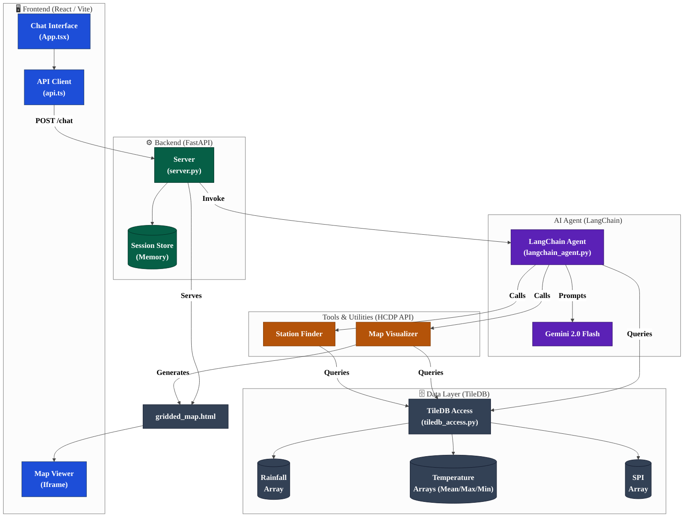

# System Architecture

The following diagram illustrates the interaction between the React frontend, FastAPI backend, LangChain AI agent, and the TileDB climate database.

## Component Breakdown

1.  **React Frontend**: Provides a premium chat interface where users can ask natural language questions. It displays the assistant's text responses and renders generated interactive maps in an iframe.
2.  **FastAPI Backend**: Acts as the bridge between the frontend and the AI. It manages conversation sessions and serves the generated HTML map files.
3.  **LangChain Agent**: The "brain" of the application. It uses Gemini 2.0 Flash to understand intent and decides which local tools to call (geocoding, data querying, or mapping).
4.  **HCDP API Tools**: Specialized Python scripts that perform heavy lifting like coordinate resolution, spatial searches, precision climate data querying, and raster map generation using `folium` and `rasterio`.
5.  **TileDB Data Layer**: A high-performance spatial database storing over 30 years of monthly climate data for Hawaii, optimized for sub-second retrieval. Now supports Rainfall, Temperature, and SPI.
