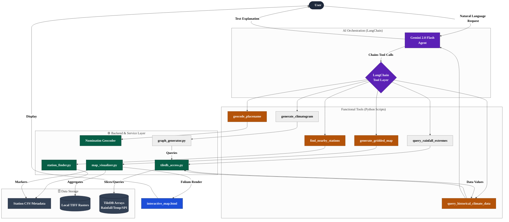

# HCDP Project Workflow Visualization

This document visualizes the architecture and operational flow of the Hawaii Climate Data Portal (HCDP) AI Assistant.

## System Architecture

The following diagram illustrates how the Gemini-powered agent interacts with the HCDP API, the high-performance TileDB database, and local raster data to serve user requests.

## Data Ingestion & Optimization Flows

The project utilizes two distinct workflows for data ingestion depending on the temporal resolution and storage requirements.

### 1. Standard Monthly Ingestion (Legacy)
Used for monthly variables (Rainfall, Temp, SPI). This flow focuses on optimizing existing large TIFF collections using lossless compression.

### 2. High-Resolution Daily Ingestion (New)
Used for storm-level daily data. This flow bypasses intermediate disk storage entirely by streaming data from the API directly into a quantized 16-bit format.

## Climatogram Generation Workflow

The following diagram illustrates the specialized process for generating high-fidelity dual-axis climatograms from the TileDB time-series data.

```mermaid
%%{init: {'theme': 'neutral', 'themeVariables': {'fontSize': '18px', 'fontFamily': 'trebuchet ms', 'primaryTextColor': '#111111', 'lineColor': '#444444', 'subgraphTitleSize': '22px'}}}%%
graph LR
    UserRequest["👤 <b>User Prompt</b><br/>(e.g., 'Chart climate for Hilo')"] --> Agent["🤖 <b>AI Agent</b>"]
    Agent -- "<b>Invokes</b>" --> Tool["🛠️ <b>generate_climatogram</b>"]
    Tool -- "<b>Coordinates</b>" --> Gen["⚙️ <b>graph_generator.py</b>"]
    Gen -- "<b>Time-Series Query</b>" --> TDB["🗄️ <b>TileDB Access</b>"]
    
    TDB -- "<b>Rainfall Data</b>" --> Gen
    TDB -- "<b>Temperature Data</b>" --> Gen
    
    Gen -- "<b>Processes Plotly</b>" --> HTML["📂 <b>outputs/climate_chart.html</b>"]
    HTML -- "<b>Served via API</b>" --> UI["🖥️ <b>Web Dashboard</b>"]

    classDef proc fill:#1D4ED8,stroke:#1e3a5f,color:#ffffff,font-weight:bold
    classDef tool fill:#B45309,stroke:#7c3700,color:#ffffff,font-weight:bold
    classDef data fill:#334155,stroke:#0f172a,color:#ffffff,font-weight:bold
    
    class UserRequest,UI proc
    class Agent,Tool,Gen tool
    class TDB,HTML data
```

> [!TIP]
> **Data Density**: Unlike simple maps, the climatogram workflow retrieves and aggregates over **400 data points** per variable to provide a complete historical view of the location's climate trends.
